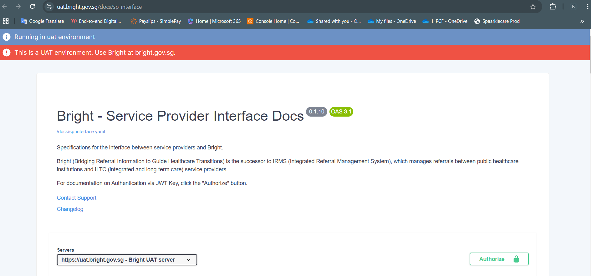
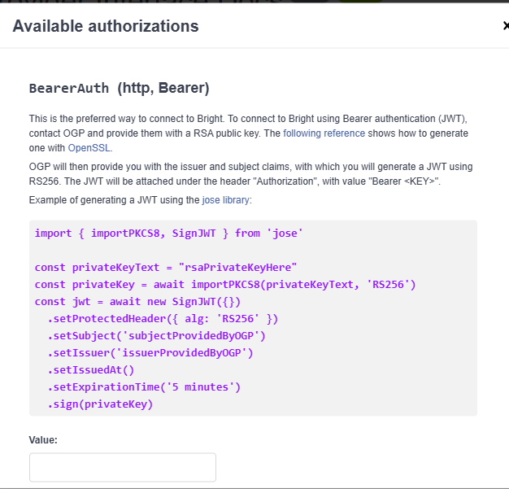
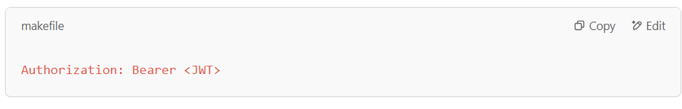
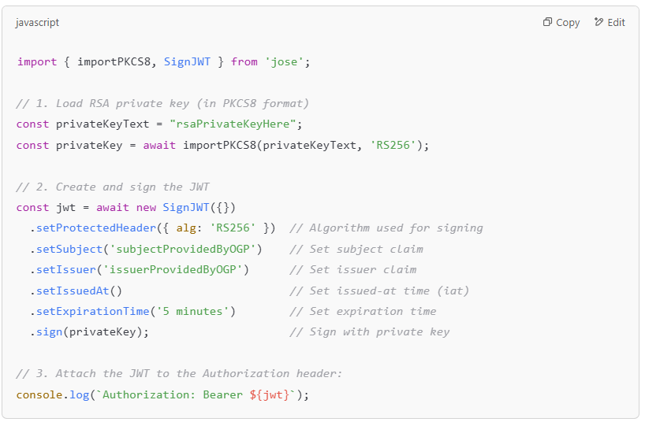

# JWT-Bearer-Authentication
Authenticate with the Bright system using Bearer Authentication with JWT (JSON Web Tokens)

Service Provider Interface Docs:  
  
https://uat.bright.gov.sg/docs/sp-interface  

Authorisation:  
  

1. Authentication Method:  
Bearer Authentication (JWT) is the preferred way to connect to Bright.  
You will need to generate a JWT signed with RS256 (RSA Signature with SHA-256).  

2. Process Overview:  
Contact OGP (likely a system administrator or service provider for Bright).  
Provide OGP with an RSA public key. This public key is used by Bright to verify JWTs you send.  
OGP will respond with:  
Issuer claim: Identifies the principal that issued the JWT.  
Subject claim: Identifies the user or entity the JWT represents.  

3. JWT Creation and Sending:  
You must create a JWT and sign it using RS256.  
Include these claims:  
iss (Issuer): Provided by OGP  
sub (Subject): Provided by OGP  
iat (Issued At): Current timestamp  
exp (Expiration Time): Validity period (e.g., 5 minutes)  
Attach the JWT to the Authorization header in the following format  
  

4. Example Code (using the jose library):  
Here’s how to generate the JWT: Refer index.mjs  
  

5.Key Concepts:  
RS256: Asymmetric encryption algorithm (RSA + SHA-256).  
JWT: Compact, URL-safe token used for authentication.  
Authorization Header: Standard way to send credentials to APIs.  

    

✅ Summary Workflow:  
Generate RSA Keys: Use OpenSSL or Node.js.  
Send Public Key to OGP: Wait for issuer and subject.  
Create JWT: Sign using RS256 and attach to Authorization header.  
Call Bright API: Include Authorization: Bearer <JWT>.  

